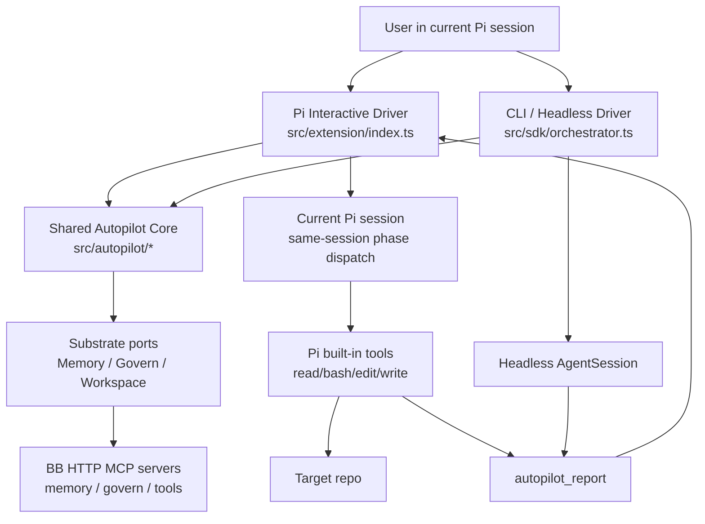
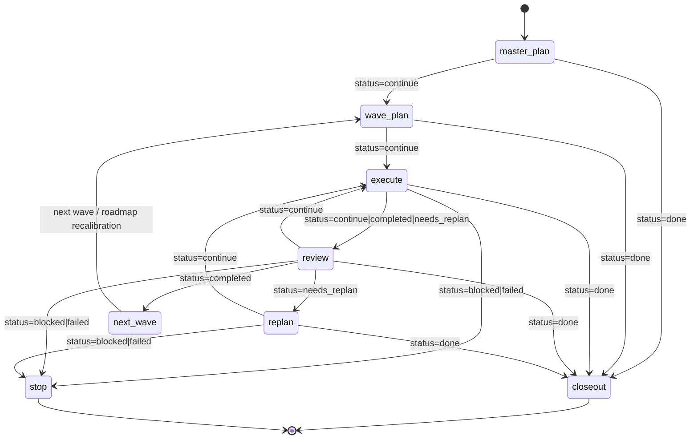

# pi-sdk Architecture

> current product stance (2026-04-16): **Pi-native interactive autopilot package with a shared headless driver**
> related: `README.md`, `docs/pi-sdk-bb-integration-architecture.md`, `docs/pi-native-interactive-autopilot-design-2026-04-16.md`

## 1. Core Goal

`pi-sdk` 的核心目标仍然不是立刻做一个“万能全自动程序员”，而是把一条 **可运行、可验证、可继续演进** 的 autopilot 主路径做成可复用产品面。

但当前产品心智已经从早期的 **CLI-first orchestrator** 收敛为：

> **Pi-native interactive autopilot package with a shared headless driver**

固定表达：

- **primary UX** = 当前 Pi session 内的 interactive autopilot
- **secondary UX** = CLI / headless / batch driver
- **truth / eval / learning** = `BB` substrate
- **Pi core** = 不做 patch

### 当前明确目标

1. 在当前 Pi session 内驱动 `master_plan -> wave_plan -> execute -> review -> replan -> closeout`
2. 用结构化协议而不是自由文本猜状态
3. 让 pause / resume / stop / reconstruction 成为真实产品能力
4. 让 CLI/headless 与 interactive driver 复用同一 shared core
5. 保持 `pi-sdk` 为 thin workflow shell，而不是把长期 truth / eval / learning 拉回本地

### 当前非目标

1. 不是 Pi core patch project
2. 不是新的 host runtime / second-session wrapper
3. 不是第一版就做多 sub-agent 并发系统
4. 不是把 benchmark / promotion / learning registry 本地化到 `pi-sdk`
5. 不是把 `BB` 变成在线 phase scheduler

---

## 2. High-Level Architecture

### Design Summary

当前架构应理解为 **四段式薄壳**：

- **Pi interactive driver**：当前 session 内的 phase dispatch、pause/resume/stop、runtime reconstruction、status/widget UI
- **CLI/headless driver**：secondary batch wrapper，仍可跑 bounded automation
- **shared autopilot core**：protocol / prompt builder / workflow engine / runtime state / closeout helper
- **substrate layer**：通过 `MemoryPort / GovernPort / WorkspacePort` 把 `BB` 作为 truth / governance / workspace substrate

固定原则：

- 当前 Pi session 是 interactive path 的执行现场
- interactive runtime 使用 deterministic routed dispatch，而不是把 phase -> skill 绑定留给模型自由发挥
- repo-local machine control plane 固定单根在 `docs/plan/*`
- CLI 仍保留，但不再是主产品面
- `BB` 继续负责 remember / judge / learn / audit
- 不靠解析 assistant prose 猜 phase completion

---

## 3. Module Boundaries

| Module | Key Files | Responsibility | Owns | Does Not Own |
|---|---|---|---|---|
| Package surface | `package.json`, `src/index.ts` | 暴露 Pi package + CLI/headless entrypoint | npm package identity, bin, extension registration | workflow truth / eval substrate |
| Pi interactive driver | `src/extension/index.ts`, `src/extension/*.ts` | 在当前 Pi session 内驱动 autopilot phase continuation | commands, same-session scheduling, runtime persistence, status/widget UI, governance preflight, session handoff glue | second hidden session / headless orchestration |
| CLI / headless driver | `src/sdk/orchestrator.ts` | bounded batch wrapper over shared core | argv parsing, session bootstrap, stdout/stderr summary | interactive scheduling semantics |
| Shared autopilot core | `src/autopilot/*.ts` | 共享协议、prompt builder、workflow engine、runtime state、closeout helper | reusable business logic for both drivers | Pi runtime API plumbing / BB adapter details |
| Shared compatibility layer | `src/shared/*.ts` | 旧路径兼容 re-export | import stability during refactor | new business logic ownership |
| Substrate layer | `src/substrate/*.ts` | 提供 `MemoryPort / GovernPort / WorkspacePort`、BB HTTP MCP client、hydration/writeback helper | substrate config, BB adapter seam, fail-open/fail-closed boundary | phase scheduling itself |
| Target repo | external `--cwd` repo | 被 agent 读取、修改、验证的真实工作区 | code, tests, build artifacts | orchestration logic |
| Pi runtime | `@mariozechner/pi-coding-agent` | session, model, tools, event stream, extension runtime | agent execution substrate | project-specific autopilot policy |

### Boundary Principle

当前核心边界已经更新为：

- **interactive driver 负责当前 session 内调度**
- **headless driver 负责 batch wrapper**
- **shared core 负责协议与状态逻辑**
- **BB 负责 truth / eval / learning substrate**

因此 `pi-sdk` 不应再把“隐藏第二个 `AgentSession` 的 extension wrapper”误当作真正的 in-Pi 方案。

---

## 4. Data Flow

### 4.1 Run bootstrap

1. CLI 接收：`--goal --cwd --model --thinking --max-waves --max-cycles --substrate ...`
2. orchestrator 解析 substrate config：
   - `local` / `bb`
   - BB memory / govern / tools endpoint
   - `docs/plan` path
3. orchestrator 创建：
   - `AuthStorage`
   - `ModelRegistry`
   - `SettingsManager`
   - `DefaultResourceLoader`
4. `DefaultResourceLoader` 注入本项目自带 extension：
   - `src/extension/index.ts`
5. orchestrator 加载一次 run-scope workspace context：
   - `workspace_scan`
   - `plan_sync`
6. orchestrator 创建 `AgentSession`

### 4.2 Phase execution loop

对于 interactive runtime 的每个 phase：

1. extension / substrate 先收敛当前 repo-local truth：
   - `workspace_scan`
   - `plan_sync`
   - local `docs/plan/*` snapshot
   - 必要时 memory / govern hydration
2. `buildInteractivePrompt(...)` 生成 phase prompt，并解析 deterministic phase route
3. route 若是 skill-bound：
   - 先解析 package-owned `<packageRoot>/skills/.../SKILL.md`
   - 若 package path 不可用，再解析 `${PI_CODING_AGENT_DIR:-~/.pi/agent}/skills/.../SKILL.md` 作为 explicit compatibility fallback
   - 被选中的 skill 文件缺失或为空会直接 hard-stop
4. extension 生成 `[AUTOPILOT ROUTED DISPATCH]` user message：
   - 显式声明 `phase -> skill/prompt surface`
   - skill-bound phase 预加载 `SKILL.md`
   - dispatch message 还会暴露 resolved skill source / file，以及 package primary path / compatibility fallback path
   - closeout phase 绑定 repo-local closeout prompt surface
5. extension 用 `sendUserMessage(built.userMessage)` 在**同一 Pi session**内继续 phase
6. `before_agent_start` 先做 selected-tools preflight：
   - 所有 autopilot phase 都要求 `autopilot_report`
   - skill-bound phase 额外要求 `read`
7. agent 使用 Pi 内建工具：
   - `read`
   - `bash`
   - `edit`
   - `write`
8. execute phase 中的高风险 tool call 会先经过 extension 的 governance preflight hook
9. phase 结束前，模型必须调用一次 `autopilot_report`
10. extension 校验 report：
    - `phase` 必须匹配当前 runtime phase
    - 当 active slice 存在时，`stepId` 必须匹配当前 slice
    - `doneWhenMet` / `stopBoundaryHit` 必须精确匹配 active slice stop law item
11. execute / review 的 progression 由 stop-law resolver 推导，而不是只信任原始 `status`
12. local mode 下，accepted `completed` / `done` report 会推进单根 `docs/plan/*` writeback，并把 next active slice 更新到下一个 stage 或 `PACK_COMPLETE`

### 4.3 Output surfaces

当前系统的输出有三类：

1. **session state**
   - Pi session file
2. **stdout/stderr streaming**
   - assistant 文本流
   - orchestrator phase summary
3. **structured report list**
   - `AutopilotReport[]`

### 4.4 Core contract

当前 outer loop 的硬协议现在有三层：

1. 每个 phase 必须 **恰好一次** `autopilot_report`
2. 当前 phase 必须走 deterministic routed surface，而不是 generic fallback prompt
3. execute / review 必须通过 active slice `done_when / stop_boundary` 解释 progression

因此当前系统不再只是“有 report 即可”，而是要求：

- route 正确
- skill / prompt surface 正确
- report phase / stepId 正确
- stop-law fields 正确
- local writeback 仍落在单根 `docs/plan/*`

---

## 5. Protocol Model

### 5.1 Phases

定义于：`src/autopilot/protocol.ts`

- `master_plan`
- `wave_plan`
- `execute`
- `review`
- `replan`
- `closeout`

### 5.2 Statuses

定义于：`src/autopilot/protocol.ts`

- `continue`
- `completed`
- `needs_replan`
- `blocked`
- `failed`
- `done`

### 5.3 Report shape

`autopilot_report` 的核心字段：

- `phase`
- `status`
- `summary`
- `waveId`
- `stepId`
- `nextAction`
- `decisionMode`
- `decisionBasis[]`
- `candidateRoutes[]`
- `doneWhenMet[]`
- `stopBoundaryHit[]`
- `evidence[]`
- `artifacts[]`
- `risks[]`
- `timestampMs`

其中：

- `decisionMode / decisionBasis / candidateRoutes` 让 replan / review / route choice 可审计
- `doneWhenMet / stopBoundaryHit` 把 active slice 的 `done_when / stop_boundary` 从 prose 提升为 runtime-consumable gate
- execute / review 的最终 progression 由 stop-law resolver 派生，而不是只使用请求侧 `status`

### 5.4 Deterministic routed dispatch and stop law

interactive runtime 当前固定 route matrix：

- `master_plan` -> `plan-creator`
- `wave_plan` -> `plan-creator`
- `execute` -> `execute-plan`
- `review` -> `execution-reality-audit`
- `replan` -> `plan-creator`
- `closeout` -> built-in repo-local closeout prompt surface

fail-fast law 当前覆盖：

- deterministic route missing
- deterministic route phase mismatch
- missing or blank routed `SKILL.md`
- selected tools missing `autopilot_report`
- skill-bound phases missing `read`
- `autopilot_report.phase` mismatch
- `autopilot_report.stepId` mismatch
- unknown `doneWhenMet` / `stopBoundaryHit` items

### 5.5 Why this protocol exists

这个协议的作用是：

- 让模型输出 **machine-consumable phase result**
- 让 orchestrator 依赖 schema + route binding + stop law，而不是依赖 prose interpretation
- 给未来的：
  - persistence
  - analytics
  - resume
  - governance
  - dashboard
  留出稳定接口

---

## 6. Phase State Transition

### 6.1 High-level state graph

### 6.2 Code-real behavior

当前代码里的细节行为是：

1. 先固定跑一次 `master_plan`
2. 然后按 wave 循环：
   - `wave_plan`
   - `execute`
   - `review`
   - 必要时 `replan`
3. 如果 review 返回 `completed`：
   - 当前 wave 视为完成
   - 若还有后续 wave，则先做一次 roadmap recalibration（仍用 `replan` phase）
4. 如果 wave 内循环没收口：
   - 在 wave 尾部补一次 recalibration `replan`
5. 所有 wave 结束后，统一进入 `closeout`

### 6.3 Current decision mapping

定义于：`src/autopilot/engine.ts`

| review status | orchestrator decision |
|---|---|
| `completed` | `next_wave` |
| `continue` | `continue_execution` |
| `needs_replan` | `replan` |
| `done` | `closeout` |
| `blocked` / `failed` | `stop` |

---

## 7. Technical Path / Why It Is Designed This Way

## 7.1 No-core-change first

该项目当前明确采用：

- **Pi core 不先改**
- 先用 extension + SDK 做组合实现

原因：

1. Pi 已经提供足够的底层 primitives：
   - session
   - tools
   - extension hooks
   - event stream
   - SDK runtime
2. 当前缺的不是底层执行能力，而是 workflow productization
3. 先验证 workflow 是否成立，再决定是否需要平台级内建能力

## 7.2 Protocol-driven, not prose-driven

核心设计不是“让模型自己记住复杂状态机”，而是：

- phase prompt
- structured tool report
- outer-loop decision

这条路径比纯 prompt engineering 更稳定，也更容易后续接持久化和治理能力。

## 7.3 Single-session serial loop first

当前先做：

- 单 session
- 单主循环
- 串行 phase 执行

而不是一上来就做：

- 多 agent fan-out
- 多 session graph
- 并发 review / planner / worker

这是为了先降低系统变量，把最核心的 loop 做稳。

## 7.4 General orchestration primitive first

当前项目倾向于先构造一个通用 autopilot protocol，而不是为某个单仓库硬编码大量 domain heuristic。

这条思路与项目当前整体方向一致：

- 优先通用 phase protocol
- 优先通用 structured report
- repo-specific workflow 以后再挂 adapter

---

## 8. Current Gaps

### 8.1 Repo-level control plane is present but still projection-oriented

当前仓库已经有：

- 单根 `docs/plan/*`
- active `PLAN / STATUS / WORKSET`
- parser-compatible `README / STATUS / WORKSET` writeback

但它仍然只是 repo-local control plane，不是 server-owned canonical run/workset head。

### 8.2 Missing canonical persistence contract

当前已经有：

- pre-phase BB hydration
- post-phase raw evidence writeback

但还没有形成：

- canonical run head
- resumable wave head
- server-owned workset materialization
- docs projection auto-generation

### 8.3 Missing hard budget / drift guardrails

当前仍然没有：

- max turns
- max token / cost ceiling
- retry budget
- fail-fast policy for drift loops

### 8.4 Missing code safety / repo safety automation

当前已落地的最小保护：

- local-mode initial-run dirty-repo guard
- control-plane-only dirty allowance（当 dirty path 仅限 repo-local active control plane / best-effort autopilot-owned paths 时允许继续）

一句话：dirty-repo guard 已落地，并且已经缩到 control-plane-aware minimum。 

当前仍然没有：

- git checkpoint per wave
- rollback point
- branch discipline / closeout discipline

### 8.5 Missing multi-agent split

现在的 planner / executor / reviewer 仍然由同一个 session 主体承担。还没有独立：

- planner subagent
- reviewer subagent
- execution worker subagent

### 8.6 Protocol fragility

当前系统默认模型会遵守：

- 每个 phase 恰好一次 `autopilot_report`

如果模型漏报、重复报、错 phase 报，当前 run 会直接失败。

---

## 9. V2 Evolution Route

### V2.1 Budget + guardrails

优先补：

- max turns / max waves / max cycles hard cap
- token / cost budget
- stuck-loop detection
- failure taxonomy

### V2.2 Persistence + resume

补 durable control surfaces：

- run manifest
- latest wave state
- resumable report ledger
- repo-level `PLAN / STATUS / WORKSET` 或等价 closeout artifact

### V2.3 Git checkpoint + closeout discipline

补：

- pre-wave checkpoint
- post-wave diff summary
- rollback strategy
- closeout artifact emission

### V2.4 Subagent decomposition

把当前单 session 主循环拆成：

- planner
- worker
- reviewer
- closeout writer

第一版仍可共用同一 report protocol。

### V2.5 Repo adapters

当 protocol 稳定后，再为具体 repo 增加：

- closeout adapter
- impact / repo preflight adapter
- workset adapter
- control-plane / observability adapter

### V2.6 Runtime observability

未来可以把：

- logs
- traces
- alerts
- runtime regressions

接成 review / replan 的附加 truth source，而不只看静态代码与测试。

---

## 10. Source File Map

| Concern | File |
|---|---|
| Package definition | `package.json` |
| CLI / outer loop | `src/sdk/orchestrator.ts` |
| In-session protocol tool + governance hook | `src/extension/index.ts` |
| Substrate config / adapter seam | `src/substrate/index.ts` |
| BB HTTP MCP adapter | `src/substrate/bb.ts` |
| Prompt hydration / raw evidence helper | `src/substrate/hydration.ts` |
| Shared prompt generation | `src/autopilot/phase-prompt.ts` |
| Transition logic | `src/autopilot/engine.ts` |
| Types / report schema | `src/autopilot/protocol.ts` |
| Public export surface | `src/index.ts` |

---

## 11. Current Verification

当前能证明这套骨架、Pi-first runtime hardening、以及 substrate foundation 已落地的最小证据：

- `npm test`
- `npm run typecheck`
- `npm run build`
- `node dist/sdk/orchestrator.js --help`
- targeted interactive tests：same-session dispatch / pause / resume / rebuild / overlay inspector
- live BB smoke：`memory_recall / memory_store / govern_policy / govern_evaluate / workspace_scan / plan_sync` read path + write path 可达
- live autopilot BB smoke：`memory_autopilot_status` / `memory_autopilot_canary_report` / `memory_autopilot_strategy_feedback_report` tool path 可达

这说明：

- TypeScript 编译通过
- targeted TDD 已覆盖 shared core、interactive runtime、substrate/config/governance/client seam
- CLI 可运行
- extension、SDK、substrate seam 已接通
- operator-facing degraded-mode / overlay visibility 已在 repo-local seams 内落地
- BB HTTP MCP integration foundation 与 autopilot-family live tool path 已真实落地

但这还不等于“自动推进系统已经 production-ready”。

## 11.1 Benchmark / promotion / learned-surface execution boundary

对当前 repo 的下一刀，应先冻结一个**不跨 repo-owned seams** 的执行边界：

1. benchmark / promotion truth 继续以 BB canonical heads、raw `autopilot_report` evidence、validation artifacts 为主
2. `pi-sdk` 本地只负责消费、投影、对齐，不额外发明第二套 benchmark truth path
3. 允许继续本地推进的 surface，仍限于现有 seams：
   - `src/sdk/orchestrator.ts`
   - `src/substrate/types.ts`
   - `src/substrate/hydration.ts`
   - `src/extension/index.ts`
4. learned surface 只允许收敛到 narrow components：retrieval reranker、next-step route classifier、repair strategy ranker、review verdict classifier、artifact summarizer
5. 一旦需要新的 truth path、本地 registry、或 Pi core / `ModelRegistry` / extension runtime patch，就应停止 repo-local execution 并转 handoff

这条边界保证 `pi-sdk` 继续是 thin orchestration shell，而不是偷渡成 benchmark registry 或 replay/eval runtime。

## 11.2 Post-P8 benchmark projection rule

在 `P8` 之后，允许继续在本 repo 内推进的 benchmark / promotion-readiness 工作，进一步收窄为：

1. 只消费 **server-owned `memory_autopilot_status` aggregate**，不在本地拼第二套 benchmark ledger
2. 只把该 truth 投影到现有 operator-facing seams：
   - status / widget / overlay
   - closeout summary
   - hydration context
3. objective key 可以在本地从 `cwd + goal` 稳定导出，但它只是 **query key**，不是本地 benchmark truth 所有权声明
4. 若 projection 继续推进需要新的 BB truth path、本地 registry、或 Pi core/runtime patch，应停止并 handoff

这保证 post-P8 continuation 仍然是 thin-shell consumption / projection，而不是重新把 benchmark ownership 拉回 `pi-sdk`。

## 11.3 Post-P9 benchmark-history inspection rule

在 `P9` 之后，允许继续在本 repo 内推进的历史 inspection MVP 进一步冻结为：

1. **current objective status** 继续通过 `memory_autopilot_status` 消费
2. **recent historical inspection** 当前只允许来自已存在的 server-owned report resources：
   - `memory://autopilot/canary/reports/recent`
   - `memory://autopilot/strategy-feedback/reports/recent`
3. `pi-sdk` 可以：
   - 读取这些 recent report resources
   - 按当前 objective key 做 bounded filtering / projection
   - 把结果投影到 status / overlay / hydration / closeout 等现有 seams
4. `pi-sdk` 不可以：
   - 创建本地 benchmark-history store / registry / ledger
   - 把 recent report filtering 升格为本地 truth ownership
   - 伪造不存在的 status-history list truth
5. 若未来需要 objective-scoped status history list，也必须继续在 `BB` server-owned truth side 增补，而不是在本地补偿

这保证 `P10` 的 operator inspection 仍然是 **BB-owned history truth + repo-local bounded projection**。

## 11.4 Post-P10 promotion-governance boundary rule

在 `P11.S3/S4` 落地后，`pi-sdk` 对 promotion-governance 的 repo-local continuation 进一步冻结为：

1. 当前已证实可消费的 BB surfaces 包括：
   - `memory_autopilot_status`
   - `memory_autopilot_canary_report` + canary report resources
   - `memory_autopilot_strategy_feedback_report` + strategy-feedback report resources
   - `memory_autopilot_decision_authority`
   - `memory_autopilot_decision_intent`
   - `memory_autopilot_decision_reconcile_plan`
   - `memory://autopilot/decision-authority/current/{objective_key}` / `recent` / `{authority_id}`
2. 这些 surfaces 的当前语义必须保持诚实：
   - `canary_verdict` / `rollout_decision` 仍是 server-owned report/eval truth，不是 repo-local runtime 可直接据此完成最终 promotion mutation 的 authority
   - final governed `promote | hold | rollback` truth 继续在单独的 BB-owned decision-authority layer
   - reconcile-plan 目前仍是 `dry_run` canonical `memory_store` payload visibility，不是本地 direct apply path
3. `pi-sdk` 当前只允许：
   - 消费这些 server-owned surfaces
   - 在 status / overlay / hydration / closeout / bounded operator UX 内投影 authority summary 与 dry-run reconcile visibility
   - 通过 BB-owned authority / intent / reconcile surfaces 发起 bounded control direction，而不拥有 durable decision truth
4. `pi-sdk` 当前不允许：
   - 创建 local decision ledger / promotion registry / rollback store / reconcile truth cache
   - 把 canary / strategy-feedback 直接等同于完整 governed rollout lifecycle
   - 绕过 BB `manual_reconcile` canonical path 发明 direct apply shortcut
5. 若后续推进仍需要新的 durable promotion decision semantics，则该 path 必须继续在 `BB` server-owned side 增补；否则当前 repo-local execution 必须停止并 handoff

这保证 `P11` 仍然沿着 **BB-owned decision truth + repo-local projection/control-only** 的 thin-shell 方向推进，而不是把 governed rollout 偷渡回本地 runtime。

---

## 12. Short Verdict

`pi-sdk` 当前是一个 **protocol-first, extension+SDK+substrate layered autopilot foundation**。

它已经验证了这条技术路径的关键假设：

- **可以不修改 Pi core**
- 先用 **structured report protocol + outer-loop orchestrator + thin substrate ports**
- 构建一个能做 `master_plan -> wave_plan -> execute -> review -> replan -> closeout` 的自动推进骨架
- 用 BB 承接 memory / governance / workspace substrate，而不是把 MCP tool names 洒回主循环

下一阶段最重要的工作，不再是 adapter seam，而是：

- canonical run/workset head
- replay / eval / canary
- budget / drift guard
- checkpoint / rollback
- subagent split
