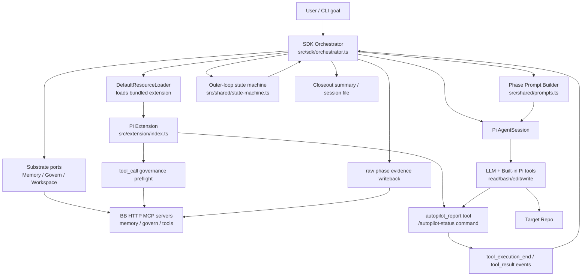
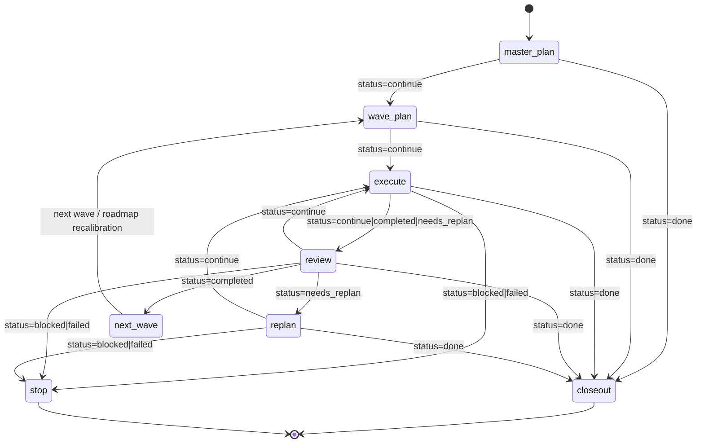

# pi-sdk Architecture

## 1. Core Goal

`pi-sdk` 的核心目标不是立刻做一个“万能全自动程序员”，而是先把一条 **可运行、可验证、可扩展** 的自动推进主路径落成 MVP。

当前项目要验证的技术判断是：

- **不先改 Pi core**
- 先用 **Pi extension + Pi SDK orchestrator** 的组合
- 把一个编程 agent 的大循环做成：
  - `master_plan`
  - `wave_plan`
  - `execute`
  - `review`
  - `replan`
  - `closeout`

### 当前明确目标

1. 让 agent 能先形成大推进纲领（master plan）
2. 把目标拆成 waves，而不是一次性全量执行
3. 对每个 wave 做线性推进：执行 -> review -> replan
4. 用结构化协议而不是自由文本猜状态
5. 形成一个可以继续演进到 budget / checkpoint / resume / subagent 的骨架

### 当前非目标

1. 不是 Pi core patch project
2. 不是第一版就做多 sub-agent 并发系统
3. 不是第一版就做完整 git rollback / checkpoint 系统
4. 不是第一版就做 repo-level `PLAN / STATUS / WORKSET` docs 控制面
5. 不是第一版就做运行时 observability / governance 全量闭环

---

## 2. High-Level Architecture

### Design Summary

当前架构已经从最早的 **双层 protocol MVP** 演进为 **三段式薄壳**：

- **in-band layer**：extension 在 agent 会话内部提供结构化状态上报与 governance preflight hook
- **out-of-band layer**：SDK orchestrator 在 agent 会话外部控制 phase loop
- **substrate layer**：通过 `MemoryPort / GovernPort / WorkspacePort` 把 BB 作为外接 substrate，而不是把 tool names 洒回主循环

这意味着：

- 模型负责完成当前 phase 并产出结构化结果
- orchestrator 负责 phase 驱动、最小 hydration、raw evidence writeback
- substrate 负责 memory / governance / workspace truth delivery
- 不靠解析 assistant 的自然语言段落来猜是否完成

---

## 3. Module Boundaries

| Module | Key Files | Responsibility | Owns | Does Not Own |
|---|---|---|---|---|
| Package surface | `package.json`, `src/index.ts` | 暴露 CLI 与可安装 Pi package 入口 | npm package identity, bin, extension registration | runtime orchestration logic itself |
| SDK orchestrator | `src/sdk/orchestrator.ts` | 创建 session、驱动 phase loop、收集报告、决定 phase 跳转 | outer loop control, run lifecycle, CLI options | in-session tool semantics |
| Extension | `src/extension/index.ts` | 向 Pi 注册 `autopilot_report`、`/autopilot-status`，并在高风险 tool call 前做 govern preflight | structured report protocol, UI status, execution gate hook | phase scheduling |
| Substrate layer | `src/substrate/*.ts` | 提供 `MemoryPort / GovernPort / WorkspacePort`、BB HTTP MCP client、hydration/writeback helper | substrate config, BB adapter seam, fail-open/fail-closed boundary | phase scheduling itself |
| Shared protocol | `src/shared/types.ts` | 定义 `phase/status/report` schema 与默认参数 | protocol vocabulary | business logic |
| Shared prompts | `src/shared/prompts.ts` | 为每个 phase 生成定制 prompt | phase-specific expectations | phase transitions |
| Shared state machine | `src/shared/state-machine.ts` | 把 review/replan status 映射为 outer-loop decision | transition logic | prompt content / tool implementation |
| Target repo | external `--cwd` repo | 被 agent 读取、修改、验证的真实工作区 | code, tests, build artifacts | orchestration logic |
| Pi runtime | `@mariozechner/pi-coding-agent` | session, model, tools, event stream, extension runtime | agent execution substrate | project-specific autopilot policy |

### Boundary Principle

核心边界是：

- **Extension 负责“状态表达”**
- **Orchestrator 负责“流程控制”**

这避免把“自动推进”全部塞进一个超长 prompt，也避免把所有状态机逻辑都塞进 extension event handler。

---

## 4. Data Flow

### 4.1 Run bootstrap

1. CLI 接收：`--goal --cwd --model --thinking --max-waves --max-cycles --substrate ...`
2. orchestrator 解析 substrate config：
   - `local` / `bb`
   - BB memory / govern / tools endpoint
   - `docs/plan` path
3. orchestrator 创建：
   - `AuthStorage`
   - `ModelRegistry`
   - `SettingsManager`
   - `DefaultResourceLoader`
4. `DefaultResourceLoader` 注入本项目自带 extension：
   - `src/extension/index.ts`
5. orchestrator 加载一次 run-scope workspace context：
   - `workspace_scan`
   - `plan_sync`
6. orchestrator 创建 `AgentSession`

### 4.2 Phase execution loop

对于每个 phase：

1. orchestrator 通过 substrate 做最小 pre-phase hydration：
   - memory recall
   - 必要时 workspace / plan summary
   - execute phase 的 governance policy summary
2. `buildPhasePrompt(phase, context)` 生成 prompt
3. `session.prompt(prompt)` 触发 agent 执行
4. agent 使用 Pi 内建工具：
   - `read`
   - `bash`
   - `edit`
   - `write`
5. execute phase 中的高风险 tool call 会先经过 extension 的 governance preflight hook
6. phase 结束前，模型必须调用一次 `autopilot_report`
7. extension 返回结构化 `details.report`
8. orchestrator 通过 `tool_execution_end` 事件捕获该 report
9. `runPhase()` 校验：
   - 本轮必须恰好有一个 `autopilot_report`
10. orchestrator 把 raw phase evidence 写回 substrate memory
   - report.phase 必须匹配当前 phase
8. orchestrator 根据 `status` 决定下一步

### 4.3 Output surfaces

当前系统的输出有三类：

1. **session state**
   - Pi session file
2. **stdout/stderr streaming**
   - assistant 文本流
   - orchestrator phase summary
3. **structured report list**
   - `AutopilotReport[]`

### 4.4 Core contract

当前 outer loop 依赖的唯一硬协议是：

- 每个 phase 必须 **恰好一次** `autopilot_report`

这比“从自然语言里猜完成度”更稳，但也意味着当前系统对协议遵守有较强依赖。

---

## 5. Protocol Model

### 5.1 Phases

定义于：`src/shared/types.ts`

- `master_plan`
- `wave_plan`
- `execute`
- `review`
- `replan`
- `closeout`

### 5.2 Statuses

定义于：`src/shared/types.ts`

- `continue`
- `completed`
- `needs_replan`
- `blocked`
- `failed`
- `done`

### 5.3 Report shape

`autopilot_report` 的核心字段：

- `phase`
- `status`
- `summary`
- `waveId`
- `stepId`
- `nextAction`
- `evidence[]`
- `artifacts[]`
- `risks[]`
- `timestampMs`

### 5.4 Why this protocol exists

这个协议的作用是：

- 让模型输出 **machine-consumable phase result**
- 让 orchestrator 依赖 schema，而不是依赖 prose interpretation
- 给未来的：
  - persistence
  - analytics
  - resume
  - governance
  - dashboard
  留出稳定接口

---

## 6. Phase State Transition

### 6.1 High-level state graph

### 6.2 Code-real behavior

当前代码里的细节行为是：

1. 先固定跑一次 `master_plan`
2. 然后按 wave 循环：
   - `wave_plan`
   - `execute`
   - `review`
   - 必要时 `replan`
3. 如果 review 返回 `completed`：
   - 当前 wave 视为完成
   - 若还有后续 wave，则先做一次 roadmap recalibration（仍用 `replan` phase）
4. 如果 wave 内循环没收口：
   - 在 wave 尾部补一次 recalibration `replan`
5. 所有 wave 结束后，统一进入 `closeout`

### 6.3 Current decision mapping

定义于：`src/shared/state-machine.ts`

| review status | orchestrator decision |
|---|---|
| `completed` | `next_wave` |
| `continue` | `continue_execution` |
| `needs_replan` | `replan` |
| `done` | `closeout` |
| `blocked` / `failed` | `stop` |

---

## 7. Technical Path / Why It Is Designed This Way

## 7.1 No-core-change first

该项目当前明确采用：

- **Pi core 不先改**
- 先用 extension + SDK 做组合实现

原因：

1. Pi 已经提供足够的底层 primitives：
   - session
   - tools
   - extension hooks
   - event stream
   - SDK runtime
2. 当前缺的不是底层执行能力，而是 workflow productization
3. 先验证 workflow 是否成立，再决定是否需要平台级内建能力

## 7.2 Protocol-driven, not prose-driven

核心设计不是“让模型自己记住复杂状态机”，而是：

- phase prompt
- structured tool report
- outer-loop decision

这条路径比纯 prompt engineering 更稳定，也更容易后续接持久化和治理能力。

## 7.3 Single-session serial loop first

当前先做：

- 单 session
- 单主循环
- 串行 phase 执行

而不是一上来就做：

- 多 agent fan-out
- 多 session graph
- 并发 review / planner / worker

这是为了先降低系统变量，把最核心的 loop 做稳。

## 7.4 General orchestration primitive first

当前项目倾向于先构造一个通用 autopilot protocol，而不是为某个单仓库硬编码大量 domain heuristic。

这条思路与项目当前整体方向一致：

- 优先通用 phase protocol
- 优先通用 structured report
- repo-specific workflow 以后再挂 adapter

---

## 8. Current Gaps

### 8.1 Repo-level control plane is present but still projection-oriented

当前仓库已经有：

- `docs/plan/...`
- active `PLAN / STATUS / WORKSET`

但它仍然只是 repo-local control plane，不是 server-owned canonical run/workset head。

### 8.2 Missing canonical persistence contract

当前已经有：

- pre-phase BB hydration
- post-phase raw evidence writeback

但还没有形成：

- canonical run head
- resumable wave head
- server-owned workset materialization
- docs projection auto-generation

### 8.3 Missing hard budget / drift guardrails

当前仍然没有：

- max turns
- max token / cost ceiling
- retry budget
- fail-fast policy for drift loops

### 8.4 Missing code safety / repo safety automation

当前没有：

- git checkpoint per wave
- rollback point
- dirty-repo guard
- branch discipline / closeout discipline

### 8.5 Missing multi-agent split

现在的 planner / executor / reviewer 仍然由同一个 session 主体承担。还没有独立：

- planner subagent
- reviewer subagent
- execution worker subagent

### 8.6 Protocol fragility

当前系统默认模型会遵守：

- 每个 phase 恰好一次 `autopilot_report`

如果模型漏报、重复报、错 phase 报，当前 run 会直接失败。

---

## 9. V2 Evolution Route

### V2.1 Budget + guardrails

优先补：

- max turns / max waves / max cycles hard cap
- token / cost budget
- stuck-loop detection
- failure taxonomy

### V2.2 Persistence + resume

补 durable control surfaces：

- run manifest
- latest wave state
- resumable report ledger
- repo-level `PLAN / STATUS / WORKSET` 或等价 closeout artifact

### V2.3 Git checkpoint + closeout discipline

补：

- pre-wave checkpoint
- post-wave diff summary
- rollback strategy
- closeout artifact emission

### V2.4 Subagent decomposition

把当前单 session 主循环拆成：

- planner
- worker
- reviewer
- closeout writer

第一版仍可共用同一 report protocol。

### V2.5 Repo adapters

当 protocol 稳定后，再为具体 repo 增加：

- closeout adapter
- impact / repo preflight adapter
- workset adapter
- control-plane / observability adapter

### V2.6 Runtime observability

未来可以把：

- logs
- traces
- alerts
- runtime regressions

接成 review / replan 的附加 truth source，而不只看静态代码与测试。

---

## 10. Source File Map

| Concern | File |
|---|---|
| Package definition | `package.json` |
| CLI / outer loop | `src/sdk/orchestrator.ts` |
| In-session protocol tool + governance hook | `src/extension/index.ts` |
| Substrate config / adapter seam | `src/substrate/index.ts` |
| BB HTTP MCP adapter | `src/substrate/bb.ts` |
| Prompt hydration / raw evidence helper | `src/substrate/hydration.ts` |
| Shared prompt generation | `src/shared/prompts.ts` |
| Transition logic | `src/shared/state-machine.ts` |
| Types / report schema | `src/shared/types.ts` |
| Public export surface | `src/index.ts` |

---

## 11. Current Verification

当前能证明这套骨架与 substrate foundation 已落地的最小证据：

- `npm test`
- `npm run typecheck`
- `npm run build`
- `node dist/sdk/orchestrator.js --help`
- live BB smoke：`memory_recall / memory_store / govern_policy / govern_evaluate / workspace_scan / plan_sync` read path + write path 可达

这说明：

- TypeScript 编译通过
- targeted TDD 覆盖 substrate/config/governance/client seam
- CLI 可运行
- extension、SDK、substrate seam 已接通
- BB HTTP MCP integration foundation 已真实落地

但这还不等于“自动推进系统已经 production-ready”。

---

## 12. Short Verdict

`pi-sdk` 当前是一个 **protocol-first, extension+SDK+substrate layered autopilot foundation**。

它已经验证了这条技术路径的关键假设：

- **可以不修改 Pi core**
- 先用 **structured report protocol + outer-loop orchestrator + thin substrate ports**
- 构建一个能做 `master_plan -> wave_plan -> execute -> review -> replan -> closeout` 的自动推进骨架
- 用 BB 承接 memory / governance / workspace substrate，而不是把 MCP tool names 洒回主循环

下一阶段最重要的工作，不再是 adapter seam，而是：

- canonical run/workset head
- replay / eval / canary
- budget / drift guard
- checkpoint / rollback
- subagent split
