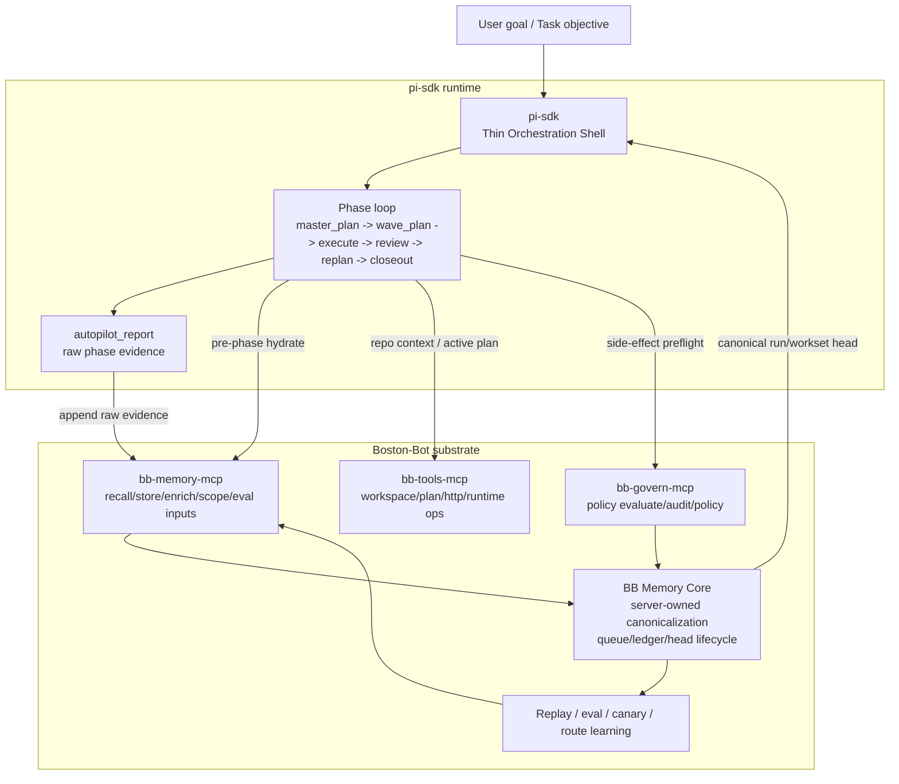

# pi-sdk × BB Integration Architecture

> status: V1 integration foundation landed on 2026-04-16; V2+ remains target architecture
> scope: `pi-sdk` as thin autopilot orchestrator + `Boston-Bot` as memory/governance/evaluation substrate
> baseline:
> - `README.md`
> - `docs/architecture.md`
> - `/home/peng/dt-git/github/pi-sdk/theBitterLessons.md`
> - `/home/peng/dt-git/github/boston-bot-vp/AGENTS.md`
> - `/home/peng/dt-git/github/boston-bot-vp/ARCHITECTURE.md`
> - `/home/peng/dt-git/github/boston-bot-vp/docs/memory-rl-technical-consensus.md`
> - `/home/peng/dt-git/github/boston-bot-vp/docs/future/autonomous-canonicalizing-memory-substrate-roadmap-2026-04-11.md`

---

## 1. Problem Statement

`pi-sdk` 当前已经有一个可运行的 autopilot MVP：

- `master_plan`
- `wave_plan`
- `execute`
- `review`
- `replan`
- `closeout`

并通过 `autopilot_report` 把阶段状态结构化回传给 outer-loop orchestrator。

但它目前仍然主要是一个 **session-local protocol shell**：

- phase 状态主要保存在当前 run 内存与 session 中
- 缺少 durable canonical run head
- 缺少 replay / eval / route learning
- 缺少长期记忆驱动的 phase hydration
- 缺少 governance-grade evidence chain
- 缺少 server-owned workset canonicalization

如果继续沿着“更厚 prompt、更复杂 skill chain、更长 orchestrator if/else”扩展，会进入典型的 **human-knowledge glue spiral**：

- 短期有效
- 长期失控
- 难泛化
- 难评估
- 难迁移到新 repo / 新任务 / 新模型

这正是 `theBitterLessons.md` 在本项目上的警示。

---

## 2. Bitter Lesson Interpretation for pi-sdk

## 2.1 What the Bitter Lesson means here

在 `pi-sdk` 这个问题上，Bitter Lesson 的正确解释不是“不要协议、不要规则、不要工程约束”，而是：

> **不要把系统的主要智能压在越来越多的人手工 workflow glue 上。**
> **把不变量保留为最小协议，把可优化部分交给记忆、搜索、评估、学习来迭代。**

### Reject

应避免把主赌注压在：

1. repo-specific prompt stacks
2. 大量 hand-written workflow branching
3. 越来越厚的 session-local state machine
4. 依赖 prose interpretation 的 phase completion 判定
5. 在 runtime / MCP facade 内塞入越来越多“临时聪明”逻辑

### Prefer

应把主线能力压到：

1. **structured protocol**
2. **append-only raw evidence**
3. **server-owned canonicalization**
4. **replay / eval / canary**
5. **route learning / rerank / utility feedback**
6. **thin consumer runtime**

---

## 2.2 Architectural consequence

因此，`pi-sdk` 的长期正确位置不是“主脑”，而是：

> **thin orchestration shell**

而 `BB` 的长期正确位置是：

> **memory-backed, governance-backed, evaluation-backed substrate**

一句话：

> **`pi-sdk` 负责 drive；`BB` 负责 remember / judge / learn / audit。**

---

## 3. Integration Thesis

## 3.1 Fixed statement

> **最佳技术路径 = 让 `pi-sdk` 保持薄的 autopilot orchestrator，同时把 `Boston-Bot` 作为长期记忆、治理、经验学习、状态 canonicalization 的 substrate。**

## 3.2 Target formula

固定表达：

> **LLM proposes -> `pi-sdk` orchestrates -> BB stores raw evidence -> BB canonicalizes run/workset head -> BB replay/eval learns -> `pi-sdk` consumes improved context next run**

## 3.3 Why this is the right split

| Concern | Should live in `pi-sdk` | Should live in `BB` |
|---|---:|---:|
| phase loop | ✅ | ❌ |
| prompt generation | ✅ | ❌ |
| agent session driving | ✅ | ❌ |
| long-term memory | ❌ | ✅ |
| governance evaluation / audit | ❌ | ✅ |
| canonical run head | ❌ | ✅ |
| replay / eval / route learning | ❌ | ✅ |
| utility feedback / rerank evolution | ❌ | ✅ |
| repo workset projection artifact generation | partial | ✅ primary truth |

---

## 4. Current BB Capability Surface Relevant to pi-sdk

基于当前可见能力，`BB` 已经不是简单 KV store，而是趋向于一个 `memory + governance + tooling + evaluation` substrate。

## 4.1 BB memory surface

当前最直接可集成的能力：

- `memory_recall`
- `memory_store`
- `memory_stats`
- `memory_enrich`

在 `BB` 仓库中，`bb-memory-mcp` 还已经扩展到更大的 memory delivery 面：

- core recall / store / stats
- scope status / reconcile 相关 surface
- enrichment / migration job surface
- route-learning / growth / observability report surface

这说明 `BB` 的方向不是“聊天附属缓存”，而是：

> **server-owned memory production system**

## 4.2 BB governance surface

当前可直接使用：

- `govern_evaluate`
- `govern_policy`
- `govern_audit_query`

这让 side-effect actions 可以不再只靠 prompt 自律，而能进入：

- policy evaluate
- approval/deny semantics
- durable audit

## 4.3 BB tools surface

当前可直接使用：

- `workspace_scan`
- `plan_sync`
- `http_request`

在 BB 仓库中的 `bb-tools-mcp` 还包括 runtime ops：

- file read/write
- dir create/list
- command execution
- HTTP request
- workspace / plan support

对 `pi-sdk` 而言，这意味着：

- repo context acquisition
- active plan discovery
- external probe
- future runtime-ops proxy

都可以逐步外接，而不是内置在 `pi-sdk` 里重做一遍。

## 4.4 BB learning / evaluation surface

从 `boston-bot-vp` 当前代码与文档可确认，`BB` 已在走：

- `utility_score`
- Q-learning style feedback
- trajectory reward
- spaced reinforcement
- shadow rerank
- canary promotion / rollback
- utility strategy tuning
- route learning reports

这正是最符合 Bitter Lesson 的可扩展学习路径：

> **先学习检索、排序、路由、判定与策略，而不是先微调整个编程模型。**

---

## 5. Target Layered Architecture



### Design principle

- `pi-sdk` = **phase driver**
- `BB memory` = **raw evidence + long-term memory + canonical head substrate**
- `BB govern` = **risk / approval / audit substrate**
- `BB eval` = **continuous strategy improvement substrate**

---

## 6. Boundary Rules

## 6.1 pi-sdk owns

`pi-sdk` 只拥有：

1. CLI / SDK entrypoint
2. phase sequencing
3. phase prompt generation
4. `autopilot_report` protocol emission
5. minimal run-local control flow
6. integration adapters into substrate

## 6.2 pi-sdk must not own

`pi-sdk` 不应演化为：

1. long-term memory truth source
2. canonical workset database
3. replay/eval engine
4. route-learning engine
5. governance decision source
6. runtime-local queue/canonicalization brain

## 6.3 BB owns

`BB` 应承担：

1. raw evidence ingestion
2. canonical head lifecycle
3. memory class routing and recall
4. governance evaluate / explain / audit
5. route-learning / rerank / utility feedback
6. replay / canary / promotion / rollback evidence

## 6.4 BB must not become

即使集成后，`BB` 的 MCP façade 也不应成为：

1. session-local autopilot orchestrator
2. prompt-driven chat shell
3. thick client-specific workflow brain
4. convenience-only shadow truth source

---

## 7. Data Model Strategy

## 7.1 Immediate principle

`autopilot_report` 不应直接等于 canonical run state。

它更适合定位为：

> **append-only raw phase evidence**

也就是：

- 每个 phase 的模型主张
- 当前看到的 evidence / artifacts / risks
- 对下一步的建议

这些是 **候选真相输入**，而不是最终 authoritative head。

## 7.2 Canonicalization principle

参考 BB 当前正在收敛的 canonicalization 思路，`pi-sdk` 的 phase/workset 状态应逐步演化为：

```text
raw phase evidence
-> normalized run candidate
-> judged phase/workset cluster
-> canonical run head
-> workset/status projection
-> replay/eval feedback
```

## 7.3 Recommended scope families

在 BB memory 中建议逐步引入以下 scope family：

| scope_family | purpose |
|---|---|
| `autopilot_run` | 单次 run 的总体阶段头部状态 |
| `autopilot_objective` | 某个长期目标的 current head |
| `autopilot_wave` | 某个 wave 的 current status |
| `autopilot_workset` | 当前活跃可执行切片 |
| `autopilot_residual` | review/replan 导出的 bounded residual |
| `autopilot_strategy` | route-learning / successful pattern 摘要 |

## 7.4 Memory class mapping

建议 phase / route / review 数据按 memory class 分层写入：

| data | memory class |
|---|---|
| single run phase report | `tool_episodic` |
| successful execution pattern | `tool_semantic` |
| reusable workflow rule | `procedural` |
| repo / environment facts | `environment` |
| user objective preference / coding preference | `user_memory` |
| policy outcome / blocked action summary | `governance` |

---

## 8. Phase Integration Design

## 8.1 Pre-phase hydration

每个 phase 开始前，`pi-sdk` 应从 BB substrate 拉最小必要 context，而不是盲目读取整个历史 session。

### master_plan

优先召回：

- repo environment facts
- 类似 objective 的 historical runs
- repo active plan surfaces（若存在）
- known failure patterns for planning drift

### wave_plan

优先召回：

- current objective head
- previous wave outcomes
- residuals not yet closed
- repo constraints / verification heuristics

### execute

优先召回：

- same-repo similar file/path work
- relevant failure/repair patterns
- known good tool sequences
- governance-relevant constraints

### review

优先召回：

- prior review verdict patterns
- regression escape patterns
- similar residual classifications

### replan

优先召回：

- prior replan success/failure examples
- strategies that resolved similar drift
- open residual cluster for current objective

### closeout

优先召回：

- expected closeout artifact structure
- prior successful closeouts
- unresolved residuals / blockers

## 8.2 Post-phase writeback

每个 phase 后至少写回：

1. raw `autopilot_report`
2. phase execution summary
3. validation evidence summary
4. governance outcome summary
5. notable tool-use pattern summary

## 8.3 Evidence model

对于每个 phase，建议形成统一 evidence bundle：

- `phase`
- `status`
- `summary`
- `next_action`
- `artifacts`
- `evidence`
- `risks`
- `tool_trace_summary`
- `verification_summary`
- `governance_summary`

后续由 BB 负责把这些 bundle canonicalize 成：

- run head
- workset head
- residual head
- learning signal

---

## 9. Governance Integration Design

## 9.1 Principle

自动推进 agent 不应依赖“模型自觉别乱动”，而应依赖可调用的 governance substrate。

## 9.2 Immediate use

在 `pi-sdk` 中优先加三类治理点：

### G1. preflight before risky execution

在进入 `execute` phase 的风险动作前，调用：

- `govern_evaluate(tool_name, args, cwd)`

尤其适用于：

- destructive bash
- wide write surfaces
- network mutation
- deployment / secret / credential operations

### G2. policy hydration before execute

进入 `execute` 之前拉：

- `govern_policy`

把当前 policy summary 注入 phase context，减少 agent 走错危险路径。

### G3. audit after deny/failure

当：

- denied
- require approval
- blocked by policy

时，写 phase evidence，并可查询：

- `govern_audit_query`

形成后续 route-learning 信号。

## 9.3 Long-term goal

长期目标不是在 `pi-sdk` 里塞越来越多 guardrail if/else，而是：

> **让治理决策与审计成为 substrate capability，而不是 orchestrator 本地知识。**

---

## 10. Replay / Eval / Learning Strategy

## 10.1 What should be learned first

最优先学习的不是“大模型自动写代码”，而是：

1. **memory retrieval relevance**
2. **route / next-step selection**
3. **repair strategy ranking**
4. **review verdict classification**
5. **artifact compression quality**

这些都有更稳定的 reward / KPI，更容易做：

- shadow eval
- canary
- rollback
- replay benchmark

## 10.2 Why not full model fine-tuning first

直接做 end-to-end coding model 微调的问题：

1. reward 定义弱
2. 训练样本早期不 canonical
3. success/failure attribution 差
4. 容易把噪声 workflow 固化进模型
5. 很难快速 rollback

## 10.3 Better progression

推荐顺序：

### Phase A — learn routing/retrieval

使用：

- `utility_score`
- route learning
- shadow rerank
- canary reports
- replay benchmarks

优化：

- 哪些 memory 该被注入
- 哪些 phase nextAction 更可靠
- 哪些 tool/use path 成功率更高

### Phase B — learn narrow models/components

基于源码 + trace + report + validation 训练：

- reranker
- route classifier
- repair ranker
- review classifier
- evidence summarizer

### Phase C — only then consider broader model adaptation

当：

- raw evidence 足够
- canonical head 成熟
- replay/eval 稳定
- route-learning 有可靠 KPI

再考虑更大的：

- planner SFT
- reviewer SFT
- repo-aware diff critique model

---

## 11. Workset Canonicalization Strategy

## 11.1 Current problem

`pi-sdk` 当前没有 repo-level active `PLAN / STATUS / WORKSET`，这意味着：

- session 能继续
- 但工作面本身不能 canonical resume
- objective/wave/workset 的真相仍然偏 session-local

## 11.2 Recommended target

建议把 repo-level `PLAN / STATUS / WORKSET` 看成：

> **projection artifacts, not the only brain**

也就是：

1. primary truth = BB canonical run/workset head
2. docs artifact = projection / export / closeout surface

## 11.3 Why this matches Bitter Lesson

如果把 workset 真相长期压在手写 markdown 上，最终会回到：

- 手工维护成本高
- 文档与代码漂移
- 很难做 replay/eval
- 很难把 learning 信号回收为机器可消费格式

因此最佳路径是：

- raw evidence machine-first
- canonical head server-owned
- docs projection human-readable

---

## 12. Implementation Plan

## 12.1 V1 Integration Slice — BB-backed memory/govern hydration

目标：在不重写 `pi-sdk` 主循环的前提下，把 BB 接进来。

### Landed implementation (2026-04-16)

已落地内容：

1. substrate ports in `pi-sdk`
   - `MemoryPort`
   - `GovernPort`
   - `WorkspacePort`
2. BB HTTP MCP adapter implementation
3. pre-phase recall/workspace/policy hydration
4. post-phase raw evidence writeback
5. governance preflight for risky execution tool calls
6. CLI/config seam for `local|bb` substrate mode

### Minimal BB surfaces used in landed V1

- `memory_recall`
- `memory_store`
- `govern_evaluate`
- `govern_policy`
- `workspace_scan`
- `plan_sync`

### Still intentionally deferred after V1

- canonical run/workset head materialization
- replay/eval/canary loop
- route-learning driven prompt/routing optimization
- full approval workflow beyond minimal risky-tool preflight

## 12.2 V2 Integration Slice — canonical run/workset head

### Deliverables

1. define `autopilot_run` / `autopilot_wave` / `autopilot_workset` scope families
2. raw phase reports written as candidate evidence
3. server-owned head materialization for objective/wave/workset
4. `pi-sdk` resume based on canonical head, not only session replay
5. optional docs projection generation

## 12.3 V3 Integration Slice — replay/eval/canary

### Deliverables

1. define success KPIs
2. replay previous runs against benchmark objectives
3. compare retrieval/routing strategies
4. canary new prompt / rerank / route strategy
5. promote or rollback based on reward delta

## 12.4 V4 Integration Slice — narrow learned components

### Deliverables

1. retrieval reranker
2. next-step route classifier
3. repair strategy ranker
4. review verdict classifier
5. artifact summarizer

---

## 13. Success Metrics

建议对 `pi-sdk × BB` 联合系统定义最小指标：

| metric | meaning |
|---|---|
| objective closeout rate | 一个 objective 最终成功 closeout 的比例 |
| wave completion rate | wave 被 honest 完成的比例 |
| review overturn rate | review 判定推翻 execution 的比例 |
| residual escape rate | 本应成为 residual 却被错误 closeout 的比例 |
| cost per accepted wave | 每个被接受 wave 的 token/cost 消耗 |
| time to closeout | 从目标开始到 closeout 的耗时 |
| memory hit usefulness | 被召回记忆对当前 phase 是否真正有帮助 |
| route improvement delta | 新 route strategy 相比 baseline 的收益 |

这些指标应该优先进入 replay/eval/canary，而不是直接进入模型训练。

---

## 14. Non-Goals

本集成路线明确不做：

1. 不把 `pi-sdk` 重写成新的通用 Agent CLI
2. 不让 `BB` 变成新的 chat runtime
3. 不在 MCP façade 内构建 thick online LLM loop
4. 不先做 end-to-end coding model 微调
5. 不在没有 canonical head / replay/eval 的前提下扩大自动化范围
6. 不把大量 repo-specific workflow glue 固化进 orchestrator 主干

---

## 15. Short Verdict

`pi-sdk` 的长期正确进化方向，不是成为更厚的 prompt/runtime/controller 组合，而是：

> **保持 thin orchestration shell，把长期记忆、治理、canonicalization、replay/eval、route learning 交给 BB substrate。**

固定表达：

> **`pi-sdk` drives phases; `BB` remembers evidence, judges canonical head, learns from outcomes, and feeds better context back into the next run.**

这条路线最符合：

1. `pi-sdk` 当前核心目标
2. `Boston-Bot` 当前真实能力与演化方向
3. `theBitterLessons.md` 所强调的“用可扩展的通用方法替代越来越厚的人类手工 glue”
